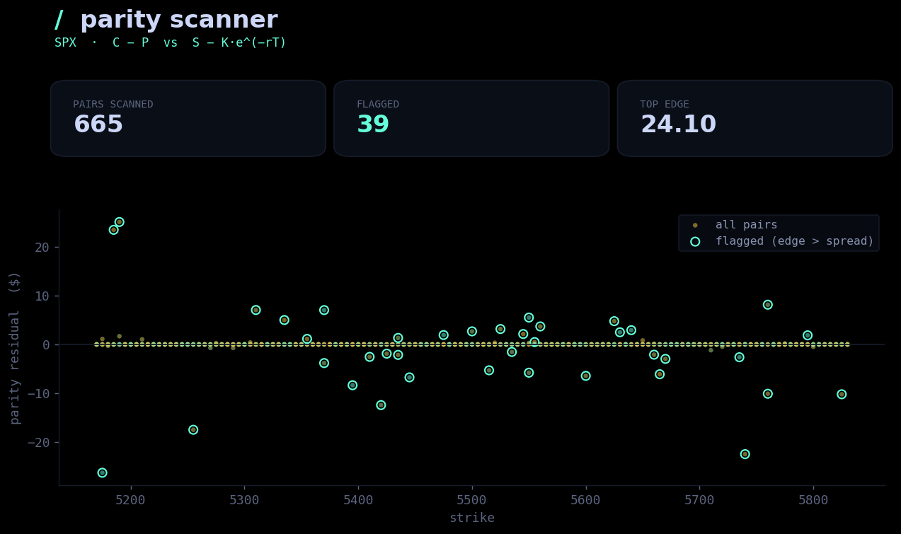

# Put/Call Parity Scanner

Scans **put/call parity** across every strike and expiration and flags the
residuals where market prices drift from theoretical fair value. For
dividend-free index options:

```
C - P = S - K · e^(-rT)
```

so the scanner measures `residual = (C_mid - P_mid) - (S - K·e^(-rT))` and
compares it to the round-trip bid/ask cost. Anything with edge left over after
crossing both spreads is a **potential arbitrage** worth investigating.




## Stack

```
backend/    Flask API (Python)
  app.py          /api/parity + serves the built frontend
  parity.py       parity residual, spread-adjusted edge, ranking
  bs.py           Black-Scholes pricing for the synthetic chain
  marketdata.py   options-chain layer (synthetic by default; Schwab hook)
frontend/   React + Vite
  src/App.jsx           page shell
  src/components/        ParityTable, StatCard
  src/theme.css         site-matched dark/mint theme
```

## Run it

```bash
# backend (port 5002)
cd backend && pip install -r requirements.txt && python app.py

# frontend (port 5173, hot reload)
cd frontend && npm install && npm run dev
```

A production build ships in `frontend/dist`, so running just the backend and
opening **http://127.0.0.1:5002** serves the built app. Rebuild with
`cd frontend && npm run build`.

By default the backend builds a synthetic chain with small random mispricings
injected, so the scanner has real residuals to rank. For live data:

```bash
export SCHWAB_TOKEN=...   # implement _from_schwab in backend/marketdata.py
```

## API

`GET /api/parity` → `{ spot, n_scanned, n_flagged, top:[{expiry, strike, call_mid, put_mid, residual, edge, signal, arb}] }`

## Notes

Educational tool, not trading advice. Real parity arbs are tiny and fleeting;
the injected mispricings here just make the mechanism visible.
